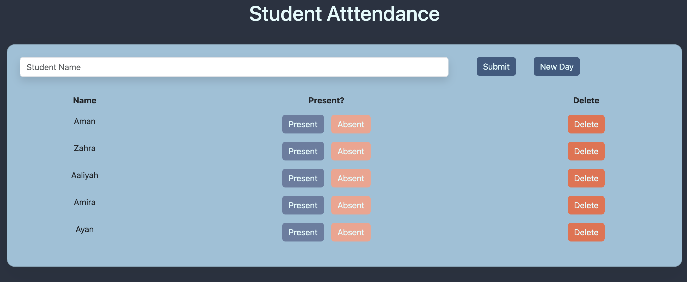

# Full Stack CRUD Student Attendance App:

## Description

_Duration: 2 hours_

Create a fully functional CRUD app that allows teachers to go through student attendance each day and mark students as present or absent.

To see the fully functional site, please visit: [DEPLOYED VERSION OF APP](www.heroku.com)

## Screen Shot

##### Tech Stack:

* Client-Side / Front-End:
  * HTML
  * CSS
  * JS
  * jQuery
* Server-Side / Back-End:
  * JS
  * [Node.js](https://nodejs.org/en/)
  * Express
  * Body Parser
  * [PostgreSQL](https://www.postgresql.org/download/)

## Installation

1. Clone this repository for your own access.
2. Open up your editor of choice and run an `npm install`
3. Using your preferred database manager - use the provided SQL file to set up the database that tracks your tasks and their status. 
4. Run `npm start` or `node server/server.js`in your terminal
5. Navigate to http://localhost:5000/

## Usage:

This application can be utilized by teachers to keep track of their students' attendance each day.

1. Using the provided input to store the student name
2. Pressing the submit button to add the student to the class
3. Using the buttons provided to update student status
  - clicking 'present' or 'absent' to update student attendance for the day
  - clicking 'delete' to remove a student from the class (maybe a student had a schedule change and is no longer in the class or completely changed schools)
4. New students can be added throughout the school year
5. pressing the 'new day' button to start over attendance each day - this will bring back the 'present' and 'absent' buttons

## License
[MIT](https://choosealicense.com/licenses/mit/)

## Acknowledgement
Thanks to [Prime Digital Academy](https://www.primeacademy.io) who equipped and helped me to make this application a reality. (Thank your people!)